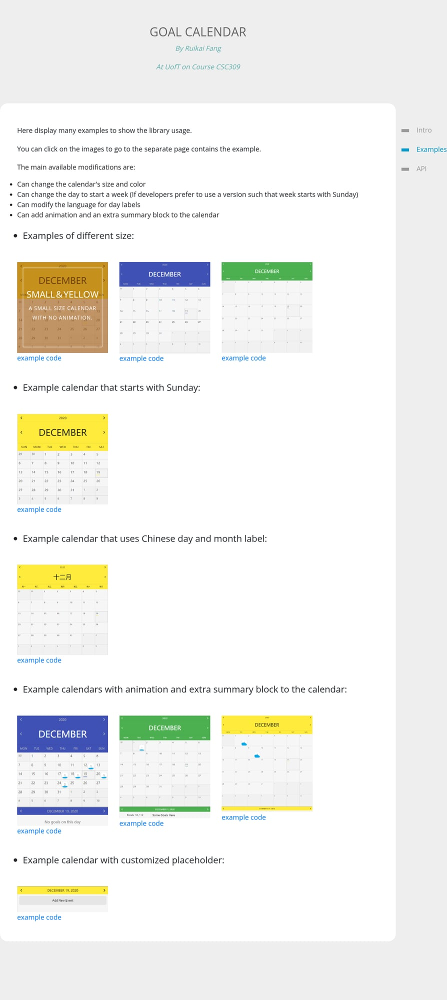
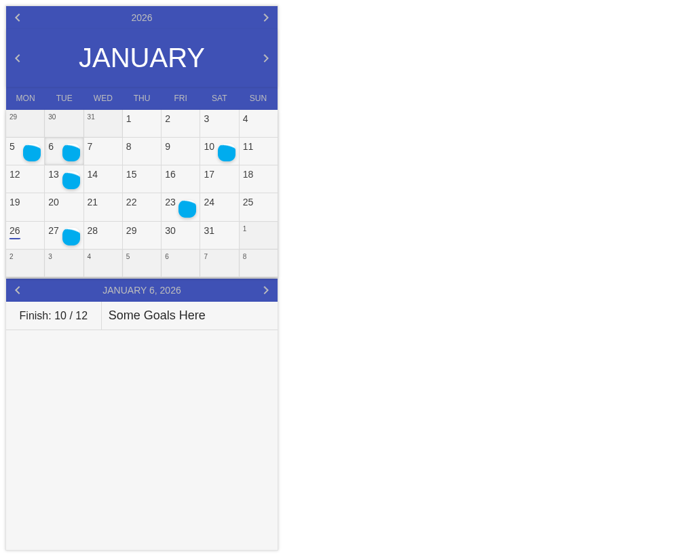

# Goal Calendar Library (CSC309 project)

A UofT CSC309-era JavaScript calendar component with a **water-filling animation** inside day cells to visualize/encourage goal progress.

This repo contains:
- an **npm package** (`goalcalendar`) built into `dist/`
- a **demo site** served by a tiny Express server (`npm start`)

---

## What it looks like

**Gallery**



**Calendar + water-fill + organizer**



---

## Quickstart (run the demo locally)

```bash
npm install
npm start
```

Open:
- http://localhost:5000/ (intro)
- http://localhost:5000/gallery.html (examples gallery)
- http://localhost:5000/snippets.html (copy/paste snippets)
- http://localhost:5000/examples6.html (calendar + organizer)

---

## Install as a library (npm package)

> Note: this repo is prepared as a publishable npm package, but publishing to npm is optional.

```bash
npm install goalcalendar
```

### Minimal usage (classic theme)

```ts
import { Calendar } from 'goalcalendar'
import 'goalcalendar/style.css'

new Calendar({
  containerId: 'calendarContainer',
  // defaults:
  // theme: 'classic'
  // size: 'large'
  // startOfWeek: 'Monday'
})
```

### Modern theme + progress-driven water fill

```ts
import { Calendar } from 'goalcalendar'
import 'goalcalendar/style.css'
import 'goalcalendar/modern.css'

const cal = new Calendar({
  containerId: 'calendarContainer',
  theme: 'modern',
})

// Example progress (complete/goal => 0..1)
cal.setFillFromRatio(10 / 12)
```

### Water-fill customization (CSS variables)

You can customize the animation via CSS variables set on the calendar container:
- `--goalcal-fill-color`
- `--goalcal-fill-speed`
- `--goalcal-fill-start`
- `--goalcal-fill-end`

---

## Project structure (high-level)

- `server.js` — demo server
- `pub/` — legacy demo pages + assets
- `src/` — package source (TypeScript wrapper + types)
- `dist/` — built package output (ESM + CJS + DTS + css)
- `tests/` — vitest tests
- `docs/` — req/plan/status + screenshots

---

## Notes / background

This is an older project. The refresh plan and progress are tracked here:
- `docs/REQ.md`
- `docs/WORKING_PLAN.md`
- `docs/STATUS.md`
